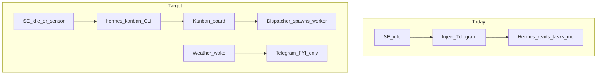

# Kanban + SE simplification (deferred)

Status: **parked** — revisit later. Not implemented yet.

## Basic idea

Build work workflows on the Hermes Kanban board. SE nudges Kanban (create / schedule / unblock cards), not Telegram, for work.

Telegram stays for human-facing FYIs only (weather, pending decisions, blocked-need-input). Maintenance, research, vault jobs, and multi-step pipelines live as cards; the Kanban dispatcher spawns workers.

## Hard constraint: no direct DB access

SE must **never** open or write `kanban.db` (or import Hermes `kanban_db`).

Integration surface for v1:

- **Primary:** subprocess `hermes kanban …` (create / schedule / unblock / list / show)
  - `create --json --idempotency-key … --assignee … --workspace dir:…`
  - `schedule <id> "overnight"`
  - `unblock <id>`
- **Not used:** SQLite paths, Python imports from hermes-agent internals
- **Later only if CLI is missing something:** documented dashboard HTTP (`/api/plugins/kanban/…`) — still not the DB

Thin SE module = CLI wrapper (argv + parse JSON stdout), same spirit as the Adapter HTTP client.

## Split

- **SE:** sensors + gates; nudge Kanban via CLI for work; nudge Telegram only for human messages.
- **Kanban:** workflows, assignees, `scheduled` / `ready` / `running` / `done`, retries, audit trail.

Kanban `scheduled` parks until something unblocks (SE / cron / human). SE times when to unblock; Kanban runs the work.

`preferred_window` (already shipped) becomes useful as “when to CLI-unblock a scheduled card,” or stays for Telegram FYIs.

## Thin spike (when we return)

1. Confirm local Kanban live; pick maintenance assignee profile.
2. Script or SE path: `hermes kanban create --json --idempotency-key se-maint-…` + optional `schedule`; workspace `dir:` vault.
3. SE flush or cron: `hermes kanban unblock` in night window (or ASAP if missed).
4. Turn off Telegram maintenance inject / `tasks.md` skill path for that loop.
5. Success: overnight work runs on the board; Telegram not flooded.

Later: thin `src/delivery/kanban.py` = async subprocess wrapper only.

## Non-goals for v1

- Opening or writing `kanban.db` from SE
- Importing Hermes `kanban_db` / internal Python APIs
- Putting weather / inbox digests on the board (keep Telegram FYI)
- Deleting `preferred_window`
- Removing Adapter inject for human messages

## Checklist when resuming

- [ ] Verify kanban + gateway dispatcher; pick maintenance assignee profile
- [ ] Spike via CLI only: create/schedule one maintenance card (idempotent, `--json`)
- [ ] Spike via `hermes kanban unblock` in preferred hours or ASAP
- [ ] Turn off chat maintenance inject path; update nudges skill/docs
- [ ] If spike works: `src/delivery/kanban.py` CLI wrapper (never `kanban.db`)
